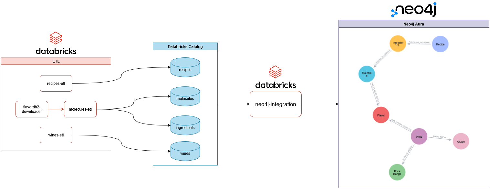
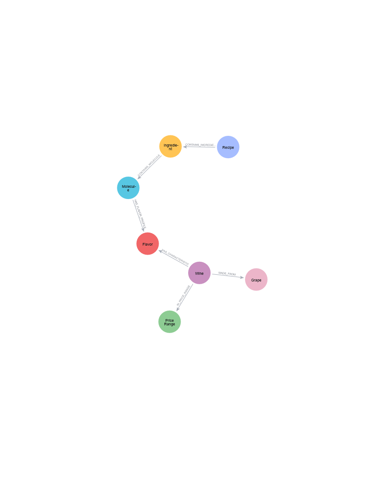

# 🍷 Harmonização de vinhos e pratos

**Bacharelado em Ciência da Computação de Sorocaba**  
**Universidade Federal de São Carlos**  
**Disciplina:** Processamento Massivo de Dados  
**Professora:** Profa. Dra. Sahudy Montenegro González

---

## Resumo
Este projeto apresenta o desenvolvimento de um sistema de recomendação para a harmonização de vinhos e pratos, fundamentado na análise de perfis moleculares. Utilizando três fontes de dados distintas — um vasto conjunto de receitas, um detalhado catálogo de vinhos e o banco de dados molecular FlavorDB — foi construído um modelo de grafos no Neo4j. O processamento e a transformação dos dados foram realizados com Apache Spark, garantindo a normalização e a integração das informações. A solução permite aos usuários descobrir combinações ideais com base na sobreposição de compostos de sabor entre os ingredientes de um prato e as características de um vinho. As consultas, elaboradas em Cypher, possibilitam filtrar as recomendações por critérios como faixa de preço, demonstrando a eficácia da modelagem em grafo para resolver problemas complexos de afinidade e recomendação.

---

## Sumário

1.  [Introdução](#1-introdução)
2.  [Objetivos](#2-objetivos)
    * 2.1. [Objetivo principal](#21-objetivo-principal)
    * 2.2. [Objetivos específicos](#22-objetivos-específicos)
3.  [Materiais e métodos](#3-materiais-e-métodos)
    * 3.1. [Fontes de dados](#31-fontes-de-dados)
    * 3.2. [Ingestão](#32-ingestão)
    * 3.3. [Pré-processamento](#33-pré-processamento)
    * 3.4. [Modelagem em grafo](#34-modelagem-em-grafo)
    * 3.5. [Infraestrutura](#35-infraestrutura)
4.  [Arquitetura do sistema](#4-arquitetura-do-sistema)
5.  [Modelo de dados](#5-modelo-de-dados)
6.  [Análise](#6-análise)
7.  [Resultados e Limitações](#7-resultados-e-limitações)
    * 7.1. [Resultados das análises](#71-resultados-das-análises)
    * 7.2. [Limitações](#72-limitações)
8.  [Conclusão](#8-conclusão)
9.  [Referências](#9-referências)

---

## 1. Introdução

A harmonização entre vinhos e pratos é uma arte complexa que envolve a análise de múltiplos fatores como ingredientes, métodos de preparo, acidez, corpo, taninos e notas aromáticas. Com a vasta variedade de receitas e rótulos disponíveis, encontrar combinações harmoniosas pode ser desafiador.

Este projeto propõe uma solução baseada em dados para facilitar o processo de harmonização, utilizando análise molecular de ingredientes e características de vinhos para gerar recomendações personalizadas.

---

## 2. Objetivos

### 2.1. Objetivo principal

O projeto foi criado com o objetivo de facilitar a harmonização de pratos com vinhos por meio dos sabores que eles possuem. Isto pode ser feito por meio de uma análise molecular dos ingredientes de um prato e por meio do sabor do vinho. Tendo estas informações, buscamos encontrar o maior número de sabores similares entre um prato e um vinho, criando assim uma harmonia no paladar. Logo, serão desenvolvidas, durante o trabalho, análises das melhores harmonizações de acordo também com a faixa de preço dos vinhos, encontrando os melhores vinhos dentro da faixa de preço estipulada pelo usuário.

### 2.2. Objetivos específicos

1.  Construir um banco de dados de grafos integrando receitas, vinhos e perfis moleculares
2.  Criar consultas para descobrir harmonizações ótimas
3.  Desenvolver análises considerando faixas de preço dos vinhos

---

## 3. Materiais e Métodos

### 3.1. Fontes de dados

#### 3.1.1. Recipe Dataset (over 2M)
-   **Fonte**: [Kaggle](https://www.kaggle.com/datasets/wilmerarltstrmberg/recipe-dataset-over[2m])
-   **Atributos**: title, ingredients, directions, link, source, NER
-   **Características**: Inclui avaliações e notas de degustação
-   **Volume**: Mais de 2 milhões de receitas

#### 3.1.2. Wine Dataset
-   **Fonte**: [Kaggle](https://www.kaggle.com/datasets/elvinrustam/wine-dataset)
-   **Atributos**: wine_id, name, description, price, capacity, grape, country, region
-   **Características**: Inclui avaliações e notas de degustação
-   **Volume**: Aproximadamente 9.000 vinhos

#### 3.1.3. FlavorDB2
-   **Fonte**: [CoSyLab IIITD](https://cosylab.iiitd.edu.in/flavordb2/)
-   **Atributos**: category, entity_alias, molecules, natural_source_name
-   **Funcionalidade**: Perfis moleculares de ingredientes e sabores
-   **Volume**: Aproximadamente 1.000 ingredientes e mais de 1.500 moléculas de sabor

### 3.2. Ingestão

O processo de ingestão consistiu na coleta e carregamento inicial dos dados de suas fontes originais. Os datasets de receitas e vinhos, disponíveis em formato CSV no Kaggle, foram carregados diretamente em um ambiente de processamento distribuído. Para o FlavorDB, que não disponibiliza um dataset unificado para download, foi necessário desenvolver um script de web scraping. Este script navegou pelas páginas de cada ingrediente, extraiu as informações moleculares e de sabor, e as salvou em formato JSON. Esses arquivos foram então consolidados em um único dataset estruturado para a fase seguinte.

### 3.3. Pré-processamento

Na etapa de pré-processamento, os dados brutos foram limpos, transformados e normalizados para garantir a consistência e a qualidade necessárias para a modelagem em grafo. As principais atividades realizadas foram:
-   **Normalização de ingredientes:** A coluna de ingredientes do dataset de receitas foi padronizada. Ingredientes foram mapeados para seus nomes canônicos encontrados no FlavorDB para permitir a futura vinculação molecular.
-   **Filtragem de receitas:** Receitas que, após a normalização, continham menos de três ingredientes válidos (presentes no FlavorDB) foram removidas. Essa medida foi adotada para garantir que as recomendações fossem baseadas em uma quantidade mínima de informações de sabor.
-   **Padronização de sabores do vinho:** A descrição de sabores do dataset de vinhos foi processada para extrair e padronizar os termos de sabor, alinhando-os com os perfis de sabor existentes no FlavorDB.
-   **Criação de entidades intermediárias:** A partir do dataset de ingredientes e suas moléculas, foram criadas duas tabelas distintas: uma mapeando ingredientes às suas moléculas constituintes e outra detalhando as moléculas e os sabores que elas produzem.

Os dados processados foram salvos como tabelas no Databricks Catalog, servindo como uma camada intermediária otimizada para a carga final no Neo4j.

### 3.4. Modelagem em grafo

#### Nós
-   `:Recipe` – Receitas culinárias
-   `:Wine` – Vinhos e suas características
-   `:Ingredient` – Ingredientes dos pratos
-   `:Molecule` – Moléculas aromáticas
-   `:Grape` – Variedades de uvas
-   `:Flavor` – Perfis de sabor
-   `:PriceRange` – Faixas de preço

#### Relacionamentos
-   `[:CONTAINS_INGREDIENT]` – Receita contém ingrediente
-   `[:CONTAINS_MOLECULE]` – Ingrediente contém molécula
-   `[:MADE_FROM]` – Vinho feito de uva
-   `[:HAS_FLAVOR_PROFILE]` – Elemento tem perfil de sabor
-   `[:HAS_CHARACTERISTICS]` – Vinho possui características
-   `[:IN_PRICE_RANGE]` – Vinho está em faixa de preço

### 3.5. Infraestrutura

Para o desenvolvimento do projeto, o primeiro passo foi encontrar datasets específicos para o desenvolvimento das respectivas tabelas. Com isso selecionamos datasets de vinhos e receitas que possuíam as informações de nosso interesse. No entanto, os dados moleculares de ingredientes não estavam dentro de um único arquivo, sendo necessária a criação de um script que uniu todas essas informações em um dataset de ingredientes. Este script baixava cada página de ingrediente em um JSON próprio, sendo elas unidas em um dataset.

Após a ingestão dos dados, foi preciso fazer um tratamento específico em cada dataset, para normalizá-los, permitindo uma modelagem final em Neo4j consistente. Para isto, foi necessária uma padronização na coluna de ingredientes no dataset de receitas, onde foram removidos ingredientes que não estavam presentes no dataset de moléculas. Com isso, foi possível remover receitas que não apresentavam ao mínimo 3 ingredientes, visto que com uma baixa quantidade de dados não seria possível alcançar a melhor combinação de valores possível.

Além disso, foi necessário fazer um tratamento similar com o dataset de vinhos. No entanto, essa padronização foi feita na coluna de sabores do vinho, sendo esta padronizada de acordo com o sabor que as moléculas obtidas possuíam.

Por fim, para que tudo isto fosse possível, por meio do dataset de ingredientes e suas moléculas foram criadas duas tabelas intermediárias, sendo uma com os ingredientes e suas moléculas e outra específica para as moléculas existentes e seus sabores.

Finalmente, os dados foram persistidos em tabelas intermediárias no Databricks Catalog, a fim de facilitar a integração com o Neo4j. A partir dessas tabelas, foram criados nós e relacionamentos no Neo4j, onde as análises em Cypher ocorreram.

---

## 4. Arquitetura do sistema

A arquitetura do sistema foi desenhada como um pipeline de dados, começando com a extração de dados brutos e terminando com a análise interativa no banco de dados de grafos.

```
[Datasets] → [Apache Spark] → [Processamento] → [Neo4j] → [Consultas Cypher]
```

### Fluxo de dados
1.  **Extração**: Os datasets de receitas, vinhos (CSV) e os dados moleculares (JSON) são carregados em um ambiente Spark.
2.  **Transformação**: O Apache Spark é utilizado para executar as tarefas de pré-processamento. Isso inclui a limpeza, normalização, filtragem e estruturação dos dados em tabelas intermediárias, que são gerenciadas pelo Databricks Catalog.
3.  **Carga**: A partir das tabelas processadas no Databricks, um script de carga é executado para popular o banco de dados Neo4j. Esse script cria os nós (Receitas, Vinhos, Ingredientes, etc.) e os relacionamentos que os conectam (`:CONTAINS_INGREDIENT`, `:HAS_FLAVOR_PROFILE`, etc.), materializando o modelo de dados em grafo.
4.  **Análise**: Com o grafo construído, as análises de harmonização são realizadas por meio de consultas escritas na linguagem Cypher. Essas consultas exploram as conexões entre pratos e vinhos, identificando sobreposições de sabor para gerar recomendações.



---

## 5. Modelo de dados

O modelo de dados foi criado com a intenção de conectar receitas e vinhos por meio de seus sabores. Dessa forma, cada receita possui ingredientes, estes ingredientes podem ter diversas moléculas e as moléculas têm sabores. Olhando pelo outro lado, o nó vinho tem suas características, que são o sabor; logo, vinhos também têm sabores. Com isso, as consultas visam encontrar vinhos e ingredientes ou receitas que possuem o maior número de nós de sabor conectando‑os, resultando na harmonização ótima. Além disso, existem nós de faixa de preço do vinho e de suas uvas, podendo também essa escolha ser feita por uva preferida ou por faixa de preço que deseja gastar na compra.

As faixas de preço dos vinhos são as seguintes:
1. Econômico (Budget): até R$100
2. Intermediário (Mid-range): de R$101 até R$300
3. Premium: de R$301 até R$500
4. Luxo (Luxury): acima de R$500  

Para uma melhor compreensão, as conexões podem ser vistas no esquema abaixo:



Ao todo, foram carregados 1.209.712 nós e 7.711.933 relacionamentos.

---

## 6. Análise

#### 1. Top 3 vinhos que pertencem a faixa de preço econômica e combinam com o prato Croque Monsieur

**Consulta em Cypher:**
```cypher
MATCH (r:Recipe {title:"Croque Monsieur"})
MATCH (r)-[:CONTAINS_INGREDIENT]->(:Ingredient)-[:CONTAINS_MOLECULE]->(m:Molecule)
MATCH (m)-[:HAS_FLAVOR_PROFILE]->(f:Flavor)<-[:HAS_CHARACTERISTIC]-(w:Wine)-[:IN_PRICE_RANGE]->(:PriceRange {name:"Budget"})
WITH w, count(DISTINCT f) AS flavor_overlap
RETURN w.title AS Wine, w.price AS Price, flavor_overlap
ORDER BY flavor_overlap DESC, w.price ASC
LIMIT 3;
```
**Explicação:**
- A consulta inicia localizando o nó da receita "Croque Monsieur".
- Em seguida, navega pelo grafo para encontrar todas as moléculas de sabor associadas aos ingredientes dessa receita.
- Paralelamente, busca por vinhos (`:Wine`) que pertençam à faixa de preço "Budget" (econômica).
- O `MATCH` central conecta as moléculas da receita com os vinhos que compartilham os mesmos perfis de sabor (`:Flavor`).
- `WITH w, count(DISTINCT f) AS flavor_overlap` agrupa os resultados por vinho e conta quantos sabores únicos eles compartilham com o prato.
- Por fim, `RETURN` exibe o nome e o preço do vinho, juntamente com a contagem de sabores em comum, ordenando pelo maior número de harmonizações e, como critério de desempate, pelo menor preço.

#### 2. Vinho da faixa de preço Premium para Spaghetti Carbonara

**Consulta em Cypher:**
```cypher
MATCH (r:Recipe {title: "Spaghetti Carbonara"})-[:CONTAINS_INGREDIENT]->(i:Ingredient)
MATCH (i)-[:CONTAINS_MOLECULE]->(m:Molecule)-[:HAS_FLAVOR_PROFILE]->(f:Flavor)
MATCH (w:Wine)-[:HAS_CHARACTERISTIC]->(f)
MATCH (w)-[:MADE_FROM]->(g:Grape)
OPTIONAL MATCH (w)-[:IN_PRICE_RANGE]->(p:PriceRange)
RETURN DISTINCT
    w.title AS wine,
    g.name AS grape,
    p.name AS price_range,
    count(DISTINCT f) AS flavor_overlap
ORDER BY flavor_overlap DESC
LIMIT 1
```
**Explicação:**
- A consulta começa identificando os ingredientes da "Spaghetti Carbonara" e seus respectivos sabores moleculares.
- Depois, procura por vinhos (`:Wine`) que possuam características de sabor (`:Flavor`) em comum com o prato.
- A consulta também identifica a uva (`:Grape`) e, opcionalmente, a faixa de preço (`:PriceRange`) de cada vinho.
- `RETURN` agrupa os resultados por vinho, uva e faixa de preço, contando o número de sabores distintos em comum com a receita.
- A ordenação `ORDER BY flavor_overlap DESC` e `LIMIT 1` garante que apenas o vinho com a maior sobreposição de sabores seja retornado como a melhor harmonização, independentemente da faixa de preço.

#### 3. 10 vinhos que potencialmente combinam com receitas que levam queijo parmesão

**Consulta em Cypher:**
```cypher
MATCH (i:Ingredient {name: "parmesan cheese"})
      -[:CONTAINS_MOLECULE]->(m:Molecule)
      -[:HAS_FLAVOR_PROFILE]->(f:Flavor)
      <-[:HAS_CHARACTERISTIC]-(w:Wine)
MATCH (w)-[:IN_PRICE_RANGE]->(:PriceRange {name: "Budget"})
MATCH (w)-[:MADE_FROM]->(g:Grape)
RETURN DISTINCT
    w.title       AS wine,
    g.name        AS grape,
    w.price       AS price,
    count(DISTINCT f) AS flavor_overlap
ORDER BY flavor_overlap DESC, price DESC
LIMIT 10
```
**Explicação:**
- Esta consulta foca em um único ingrediente: "parmesan cheese".
- Ela encontra todos os vinhos da faixa de preço "Budget" que compartilham perfis de sabor com as moléculas presentes no queijo parmesão.
- A consulta também coleta informações sobre a uva de cada vinho.
- `RETURN` lista os vinhos, suas uvas, preços e a contagem de sabores compartilhados com o parmesão.
- A ordenação `ORDER BY flavor_overlap DESC, price DESC` prioriza os vinhos com mais sabores em comum e, para aqueles com a mesma contagem, lista os mais caros primeiro (dentro da faixa "Budget"), retornando o top 10.

---

## 7. Resultados e limitações

### 7.1. Resultados das análises

**1. Harmonização para Croque Monsieur:**
| Wine                                                         | Price | flavor_overlap |
| ------------------------------------------------------------ | ----- | -------------- |
| "Yellow Tail Chardonnay 2021/22"                             | 59.45 | 5              |
| "Smith & Wright Chardonnay 2020/21, Australia"               | 59.45 | 5              |
| "Wolf Blass Yellow Label Chardonnay 2021/22, South Australia"| 74.33 | 5              |
*Os resultados indicam que três vinhos brancos da uva Chardonnay, todos na faixa de preço econômica, são as melhores opções, compartilhando 5 perfis de sabor distintos com os ingredientes do prato. Isso sugere que as notas amanteigadas e frutadas do Chardonnay complementam bem o queijo e presunto do sanduíche.*

**2. Harmonização para Spaghetti Carbonara:**
| wine                                      | grape      | price_range | flavor_overlap |
| ----------------------------------------- | ---------- | ----------- | -------------- |
| "Toast & Honey Chardonnay 2021, California" | "Chardonnay" | "Mid-range" | 8              |
*A análise apontou um "Toast & Honey Chardonnay" da Califórnia como a harmonização ideal, com uma sobreposição de 8 sabores.*

**3. Harmonizações com Queijo Parmesão:**
| wine                                                                           | grape             | price | flavor_overlap |
| ------------------------------------------------------------------------------ | ----------------- | ----- | -------------- |
| "Dr Loosen Slate Hill Riesling 2021/22, Mosel"                                 | "Riesling"        | 89.21 | 5              |
| "Nettie Viognier 2019/21, California"                                          | "Viognier"        | 89.21 | 5              |
| "Devil's Creek 'Gold Reserve' Sauvignon Blanc 2022, Marlborough"               | "Sauvignon Blanc" | 96.65 | 4              |
| "Emiliana 'Elemental' Organic Gran Reserva Viognier 2021/22, Casablanca Valley" | "Viognier"        | 96.65 | 4              |
| "Russian Jack Sauvignon Blanc 2022, Marlborough"                               | "Sauvignon Blanc" | 96.65 | 4              |
| "Pasqua DLZ ‘Idealysta’ Chardonnay-Fiano 2022, Puglia"                          | "Chardonnay"      | 96.65 | 4              |
| "Waimea Estates Sauvignon Blanc 2022, Nelson"                                  | "Sauvignon Blanc" | 96.65 | 4              |
| "Oyster Bay Chardonnay 2020/21, Marlborough"                                   | "Chardonnay"      | 92.93 | 4              |
| "In 2022"                                                                      | "Sauvignon Blanc" | 92.93 | 4              |
| "Brancott Estate Sauvignon Blanc 2022, Marlborough"                            | "Sauvignon Blanc" | 92.93 | 4              |
*Para o queijo parmesão, a análise retornou uma variedade de vinhos brancos. Riesling e Viognier lideram com 5 sabores em comum, seguidos por Sauvignon Blanc e Chardonnay com 4.*

### 7.2. Limitações

#### 7.2.1. Limitações técnicas
-   **Versão gratuita do Neo4j**: Restrição no número de nós e relacionamentos
-   **Processamento de dados**: Remoção significativa de dados durante a normalização
-   **Compatibilidade**: Apenas ingredientes presentes no FlavorDB2 foram mantidos

#### 7.2.2. Limitações funcionais
-   **Análise incompleta**: Não considera corpo do vinho, textura do prato e acidez

### 7.3. Entregas
-   Sistema funcional de harmonização baseado em análise molecular
-   Banco de dados de grafos integrado com três fontes de dados
-   Algoritmo de recomendação considerando faixas de preço
-   Relatórios com top‑10 harmonizações para pratos predefinidos

---

## 8. Conclusão

O projeto desenvolveu um sistema de harmonização de vinhos e pratos baseado em análise molecular. Apesar das limitações técnicas e funcionais identificadas, o sistema demonstra a viabilidade de usar tecnologias de Big Data e bancos de grafos para resolver problemas complexos de recomendação.

---

## 9. Referências

-   **[Apache Spark](https://spark.apache.org/docs/latest/sql-programming-guide.html)**: Usado para processar e transformar os dados dos arquivos CSV.
-   **[Neo4j (Banco de Dados de Grafo)](https://neo4j.com/developer/graph-database/)**: Utilizado para modelar e armazenar as conexões entre vinhos, ingredientes e moléculas.
-   **[Cypher (Linguagem de Consulta)](https://neo4j.com/docs/cypher-refcard/current/)**: Usada para buscar e descobrir as harmonizações dentro do grafo de dados.